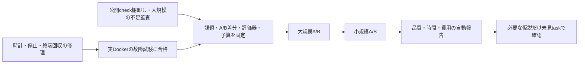

# Cycle 004後の再計画: 最短で採否を決められる比較へ

更新: 2026-09-05。状態: **設計・優先順位の決定。以下の新しい実行方式・比較は未実装／未実行。**
実行順の正本は[現行計画](../project-plan.md)。これまでの[計画履歴](../project-plan-history-through-cycle-004.md)、
[Cycle 004の原結果](../../experiments/development-harness/cycle-004/README.md)を変更しない。

## 目的と今回の判断

目的は、実開発で使える成果の品質を上げ、そこへ到達する総時間と費用を減らすこと。
速い実装と高い品質を別々に測り、小規模・大規模の結果を別々に出す。
評価の実行、要求公開、停止、検査、集計はコードで決め、人やLLMに採点を依頼しない。
絶対的な最短・最適は未証明なので、次の判断に必要な証拠を最も安く得る順序を選ぶ。

**次に行うのは新課題の連続投入ではなく、途中freezeを使わない最小の測定経路の完成。**
その後、正常に検証できる共通環境で、自由な自己検証と自動的な検証フィードバックを比較する。
大規模候補を先に成立させ、小規模の負担増加も同じ比較系列で確かめる。

## 根拠の再点検

| 観察した事実 | そこから言えること | 今回の判断 |
| --- | --- | --- |
| Cycle 004の環境準備は582秒弱＋375秒弱、計956.559秒 | 準備費は無視できない。共通image/cacheを作る以前の費用は別途未計測 | 固定toolchain/cacheを再利用し、準備を毎回の新機能開発にしない |
| 統合後の138テスト612.450秒と、順次実行したbuild・配布確認530.680秒 | この区間だけで1,143.130秒。全作業時間や他の並行観測の合計ではない | 開発中の短い確認と最終の必須確認を分け、総時間も記録する |
| 約120秒で対照13/22、改良22/22。後の観測では両成果が22/22 | 一時点の到達差はあるが、満点から品質改善量や一般効果は分からない | 小さなJSON修正の追加を次の主目的にしない |
| 提出後の停止処理を含む1,200.873秒で対照が予算超過 | 現在の時計は提出時間と後片付けを分離できない | 時計をversion化し、元の判定を保持する |
| 実行中のcheckpointで`docker unpause`がtimeout | 観測経路そのものが実行を中断した。ホスト遅延の原因は未確定 | 定期的な全体freezeを標準経路から外す |
| 通信制限下の検査不成立は既存probeと複数cycleで観測済み | 能力不足の再現には価値があるが、同じ不備へのlive比較の追加利益は小さい | 能力probeを回帰へ移し、次の対照も必要な検証を実行できる条件にする |
| 成果の修正・採用と、環境介入の一般的な効果は別 | 良い機能が入っても、比較仮説が実証されたとは限らない | 成果の採用、探索での候補選定、効果の確認を別の判断として残す |

数値の根拠は[provenance](../../experiments/development-harness/cycle-004/provenance.json)と
[integration](../../experiments/development-harness/cycle-004/integration.json)。未計測のreview時間や
過去の作成費用を推定で足さず、重なった作業を足して「総所要時間」にもしない。

## 比較した進め方

| 案 | 利点 | 欠点・残る不確実性 | 採否 |
| --- | --- | --- | --- |
| 既存のpause/unpauseに再試行・長いtimeoutを追加 | 旧方式からの変更が小さい | 全体停止、実行への干渉、追加待ちを残す。故障原因は未確定 | 旧runの復旧互換だけに限定 |
| 非停止copy、CoW filesystem、snapshot専用サービス | 高頻度の途中観測を狙える | 非停止copyは不整合になり得る。atomic snapshotの能力は未確認。運用対象が増える | 今回は採らない |
| 正常提出・固定上限・段階境界で停止確認後に回収 | 既存のarchive/evaluatorを使え、再開失敗経路を減らせる | 細かな到達曲線は得られない。打ち切り時の停止遅延を扱う必要がある | **次の標準経路** |
| いきなり大きなtask群や長時間batchへ拡大 | 課題の幅は増える | 計測故障・費用の欠測を増幅する | 最小経路と大規模候補の校正後へ |
| 先に多人数・複数model・review方式を総当たり | 改善候補が広い | 要因が混ざり、run数・調整費が増える | 最初の比較では一つの介入に絞る |

Dockerのpauseはcontainer内の全processを停止するため、単なる読み取り観測ではない。
この仕様と今回のコード・障害から、観測の干渉を減らす設計を選ぶ。
全体停止が今回の全遅延・検査失敗の原因だったと断定するものではない。
[Docker公式仕様](https://docs.docker.com/reference/cli/docker/container/pause/)

## 測定contractの改訂

### 一つのrunから、提出時間と予算内の到達品質を得る

両条件に同じ上限Bと公開要求を与え、正常提出ならそこでsourceを固定する。
未提出ならBで停止を要求し、実際のwriter停止を確認してから保全する。
大規模側では段階終了時にも停止・回収し、同じ開発履歴を次段階へ引き継ぐ。
段階終了は独立sampleに数えず、共通公開要求の成績と全体進捗を分ける。

- 正常提出物が外部の固定品質条件を満たした場合に、提出時刻を品質付き提出時間とする。
  外部検査の時刻を提出時刻へ足さない一方、利用可能までの総時間には含める。
- 早期に提出した成果をBまで変更しないなら、その品質をBの成果として持ち越せる。
  待機を開発費へ加算しない。両条件で早期終了と追加検証の権利を同じにする。
- 上限に達した成果は打ち切り成果として品質を測る。提出済み・完了・既知usageへ変換しない。
- Bでの停止要求から実際の停止まで書込みが続いた可能性があれば、Bちょうどの品質は不明。
  要求時刻、停止確認時刻、capture区間を保存し、「固定上限と停止方針の下で得た成果」と表示する。
  観測窓の許容幅はprovider-free校正から事前固定し、超過時は同時間比較をunknownにする。
  遅い停止で得た追加の作業時間を、同じ予算での改善に見せない。
- 途中経過が採否を変える場合だけ、別の短い上限で独立したrunを事前登録する。
  当初から多数の時点×課題×条件を走らせない。既存の疎な観測から到達秒を補間しない。

周期的pauseを外すことは、無停止copyの整合性を保証したことではない。
回収前後の停止証拠、source identity、archive hashを引き続き必須にする。

### 時計と費用

| 項目 | 定義・不明時の扱い |
| --- | --- |
| 準備時間 | checkout・image/cache準備、能力確認。cacheの温まり方も記録 |
| 開発時間 | 開発開始から正常な提出観測まで。開発側のtest・待機・再開・修正を含む |
| 検証フィードバック時間 | 介入で実行する公開checkと修正session。開発予算を消費し、無料にしない |
| 停止・回収時間 | 停止要求、停止確認、archive完了を別eventにする |
| 独立評価・配布時間 | 元の成果を変えない外部評価、build、配布済み経路の確認 |
| 利用可能までの時間 | 必要な準備開始から要求された最終検証完了までの実経過時間。並行区間を合算しない |
| usage | sessionごとのinput/cache/output等と既知分。欠測はunknown。観測通知後のoutput capは厳密なin-turn上限ではない |
| 修理・統合費 | runner開発、後処理、candidateの統合修正を別記録。修正後の成果を元のrunへ戻さない |

利用可能までの時間は、各条件の元の成果が共通の最終条件を満たしたときだけ確定する。
不合格ならそこまでの消費は記録するが、利用可能になった時刻は未達とする。
primaryが補修して利用可能にした時間は別の統合結果で、A/Bの到達時間を上書きしない。

同じprocessでのelapsed timeにはmonotonic clockを使い、停止処理より前に提出eventを保存する。
process再起動をまたぐ精密時間を、不一致の時計や最後のprogressから推定しない。
予約計上は実測時間と別fieldにし、欠測を隠さない。
[Python公式仕様](https://docs.python.org/3/library/time.html#time.monotonic)

### 中断後も採点まで閉じる

既存の`automatic/finalize_interrupted.py`を再利用するが、一括入口への接続はこれから実装する。
予定する遷移は「実行 → 正常提出または期限／異常 → 停止確認 → 保全 → 固定検査 → 集計」。
停止を確認できない場合は「停止未確認」の構造化結果で終了し、採点・後続起動を行わない。
起動失敗、途中中断、評価器故障、候補の品質不合格を別reasonにする。
完了済み成果の検証再実行と、開発モデルのやり直しを混同しない。
古いmanifest・clock・gradeを読み替えず、新版だけで新しいrunをsealする。

独立した有限の停止監視は必要だが、新しい常駐schedulerは作らない。
現在のtimeout・container identity・既存の所有権管理で満たせる範囲から実装する。
機能があると仮定せず、recorderが失われた時も実際にwriterが停止することを試す。

## 次に比較する改善: 検証と修正の進め方

通信制限で必要なテストが起動しない条件は能力の回帰試験として残す。
次の比較では、必要な検証が動く同じ実行条件を両方へ与える。既定の利用者権限を
無断で広げることや、同じ権限なら安全性も証明済みという意味ではない。
具体的な実行profileとアクセス範囲は能力probe後にmanifestへ固定する。

| 条件 | 開発者が使えるもの | 制御する違い |
| --- | --- | --- |
| A: 強いsoloの自己検証 | 現行の修正済み基盤、同じ公開checkと手順、同じ課題・model指定・権限・累積予算。自分で何度でも予算内の検証・修正ができる | 自分で検証と提出のタイミングを決める |
| B: 公開検証の自動フィードバック | Aと同じ。隠されたoracleや追加の解答情報は渡さない | 提出候補に対し事前登録した公開checkを自動実行。失敗なら残予算内で結果を返して修正へ進む |

仮説は、Bが検証忘れ・無益な全件検査・不必要な自己調査を減らし、品質または総時間を改善すること。
**未実証の仮説**であり、Bが同じ検査を重複実行して遅くなる、追加sessionでcontextを失う可能性もある。
単なる「テスト実行回数が増えた」を成功にしない。

公開checkの選択表と手順はAにも渡す。Aの自主的な検証や修正を禁止して弱くしない。
Bのsession・check・feedback・待機はすべて同じ累積予算へ計上し、usage不明なら追加起動しない。
機械が実行するcommandは信頼したtask側で列挙し、候補の任意の申告commandを採用しない。
隠された最終検査は両条件の終了後に実行し、その結果を開発へ返さない。
後続要求を公開する条件と、公開済み要求の対応付けも両条件で揃える。

まず既存checkの短い組合せと最終必須suiteを明示的な表にする。自動依存解析製品は作らない。
既存のAGENTS.md等が要求する確認を削る場合は先に理由・代替の保証を明示する。
高速確認だけをrelease合格にはせず、比較する全成果へ同じ必須外部確認を課す。
採用する一案だけを配布検査して、未検査の他案とのrelease品質差を主張しない。
同一source・環境・検査contractの証拠だけ再利用し、codeが変わったら必要範囲を再検証する。

## 大規模側を先に選ぶ

履歴paginationの下書きは保留する。便利でも、それだけで大規模側の代表にはしない。
小さなJSON修正や既に解いたtaskは校正に使い、次の未見taskの代わりにしない。

第一候補は、**既存の依存jobを、独立検証・中断復旧・収集reportまで有限の操作で進める利用経路**。
現在の[操作手順](../agentctl.md)にはrun/check/validateと依存の収集があり、個別の能力は揃っている。
成功時にCLIを順に呼ぶだけなら薄いscriptで十分なので、その場合は「大規模」として採らない。
実際の課題選定では、下記の結合した不足が存在するかを先に再現する。

| 変更系列 | 検査する利用結果 | 必要な結合 |
| --- | --- | --- |
| 動く縦断経路 | 固定した依存taskの実行、元のacceptanceの独立実行、検証済み依存だけを後続へ解放、収集report | CLI・SQLite状態・既存supervisor・command検証・Gitのsource同一性 |
| 継続変更 | 途中まで済んだ実データへ再開／再試行要求を追加し、完了済みの副作用を重複させず、dirty/stale/failedを混同しない | 先の候補が実際に作った状態と、後の実装・既存の所有権管理 |
| 運用と配布 | client喪失、検証中断、旧形式の状態、配布済みCLIで同じ利用経路が成立する | process停止・復旧・state互換・配布経路とそれまでの全要求 |

これは課題候補であり、上記機能の欠落を今回すべて再現したという報告ではない。
自動merge/push、破壊的GC、新しいprovider、無期限schedulerへscopeを広げない。
既存collectの引継ぎreportとsingle-writer境界を維持する。
評価用の実project状態はrepo外へ置き、ここにdemo appを追加しない。

**大規模候補の選定条件:** 独立小問の集合ではなく、前の設計・状態が後の成否を左右すること。
component数や段階数にノルマを置かず、利用上の要求と、その依存・退行・移行を示せること。
既存の簡単な組合せで十分なら素直に採用し、実装を膨らませてbenchmarkにしない。
このrepoで満たせなければ外部の実projectの変更系列へ切り替える。適切なsourceと利用要求が
ない間は大規模への有効性を未測定とし、小規模成功で代用しない。
一つの結合taskの結果も、大規模project全体や他業種への一般化にはしない。

## 順序・実行量・停止条件

各段階の完了はartifactと機械的な判定で決める。週数や人の採点待ちを設定しない。

| 段階 | すること／成果物 | 完了条件・失敗時の分岐 |
| --- | --- | --- |
| P0: 測定の最小修理 | 新clock、周期pauseなしの終端回収、異常時の停止・保全・集計を一括入口へ接続 | 下記fault matrixと実Dockerの疑似provider試験が合格。停止不明ならliveを開始しない |
| P1: 比較する手順を固定 | 公開check表、A/B差分、各費用の記録。既存image/cacheの同一性と検証能力を確認 | Aも正常検証可能。Bの追加費用と情報が明示され、全件checkを外へ隠さない |
| P2: 課題と評価器を固定 | 大規模候補を先に監査し、その後に別familyの小規模を選ぶ。要求対応表・oracle・段階入力をseal | 既知の正解と代表的欠陥を識別。複数の妥当な実装方針を許す。規模条件と全上限が未確定なら開始しない |
| P3: 最小の探索比較 | 大規模A/Bを先行し、小規模A/Bも同じ介入で実行。旧runの再実行にはしない | 全条件・未着手・中断を台帳に残し、自動評価。基盤の重大な故障なら未開始のcellを止め、原因修理へ戻す |
| P4: 採否と確認 | 速度・品質・総費用の差から、残す仮説と次に確認すべき点を選ぶ | 有望なら別の未見taskで確認。効果なしならその介入を終了し、勝つまでrunを追加しない |

P0のfault matrixは、正常提出後の遅い停止、予算打ち切りと停止前の遅延書込み、usage欠測、recorder喪失、停止API異常／
停止未確認、archive不完全、外部評価器異常を個別に注入する。正常な複数段階の進行も試す。
原記録が残り、未知の状態が合格せず、後続を誤起動せず、有限に結果を返すことを要求する。
旧pause方式の全ての性能原因を調べ切ることを、P0の完了条件にはしない。

ゲートの完了順と、作業の着手順は分ける。P0のDocker試験を待つ間に、P1の既存check棚卸しと
P2の課題の読取監査・要求対応表を前倒しできる。最終のcheck表と予算はtaskが確定したP2でsealする。
実モデルの比較中には重いbuild・全件評価を重ねず、計測条件を守る。

### 初期の費用枠

以下はこの探索系列だけの**仮置き**で、現行runnerのdefaultでも実行開始済みの予算でもない。
ownerはprimary/integrator。P2で課題の実需要・公開check所要時間・phase予約を確認してから
最終manifestへ具体値を固定し、変更理由を記録する。適合しないtaskを時間合わせで小さくしない。

| 設定 | 分類 | 仮置きと根拠／見直し条件 |
| --- | --- | --- |
| 最初の比較cell | cost cap | 小規模・大規模それぞれA/Bの計4開発run。両規模の探索に必要な最小の対応。統計的な有効性証明の本数ではない |
| 小規模の開発上限 | cost capの候補 | 20分・観測output 25,000／条件。前回の使用量16,537と検証費を参照し、異なるtaskの校正で変更可能 |
| 大規模の累積上限 | cost capの候補 | 120分・観測output 120,000／条件。既存の約49–65分・92,945 outputを超える継続変更の余地を仮置き。各phaseへの予約はP2で決める |
| 開発cellの同時実行 | cost cap | 初期は1。今回ホスト遅延が観測され、条件同士の資源競合を避ける。相互に独立した資源を確認した別protocolで見直す |
| 品質・source整合・停止証拠・欠測保持 | hard guard | 全cellで必須。時間や費用のために緩めない |

この仮置きなら、開発の最大枠は計280分（4時間40分）。準備・独立評価・統合費を含む
完了見込みではない。実際の外部検査のcost cap、保存容量、停止・capture許容幅、session上限、
追加修正の開始予約、実行順seed、品質の主要項目と効果判定の境界をP2で確定する。
一つでも未定ならsealを拒否する設計にする。現在のcodeが既に全項目を検査するとは主張しない。
金額の単価・完全なusageがないので、円／ドルの上限やROIはこの計画では推定しない。

### 順序と確認のルール

同一task・source・環境をblockにし、A/Bの順番を事前のseedで決める。
別taskでは順番も偏らないように割り付け、元のcheckoutから始める。
規模ごとに1組だけでは順序効果を除去できないことを明示する。
これはNISTのblocking/randomizationの考え方を、このrepoの実験へ適用する設計上の判断である。
[NIST実験計画](https://www.itl.nist.gov/div898/handbook/pri/section3/pri332.htm)

- 品質低下・重大欠陥を速度で相殺しない。速度改善だけ、品質改善だけ、両方、trade-off、不明を別々に出す。
- 速度は同じ固定品質条件を満たした提出の時間と到達率で評価する。未達を上限秒の完成とせず、成功例だけの平均も採否の正本にしない。
- fixed-budget品質は要求単位で比較し、fixture数を加点しない。停止の時刻が揃わない場合の不明を保持する。
- 条件固有の資源消費が故障を起こした可能性があれば、単なる外乱として除外しない。原因未確定のまま全cellを報告する。
- 初回の有望差は候補選定まで。確認比較のtask群・反復数・上限は初回の揺れと必要精度から別途事前固定する。
  同じtaskを増やすこととtask間の一般化を区別し、少数の反復へ有意差や汎化を仮装しない。
- 追加runは「何の判断を変えるか」を説明できる場合だけ別protocolで行う。
  満点の小課題を増やすだけ、勝つまで反復するだけなら停止する。
- 決定的な不具合修正は再現・回帰・配布確認で採用できる。比較仮説の採用や通常権限の変更と混同しない。

## 自己批判と残るtrade-off

| 反論 | 点検後の判断 |
| --- | --- |
| 終端だけでは品質向上を測れないのでは | 固定上限で得る品質と品質条件付き提出時間は測れる。細かな到達曲線は失うので、必要時だけ短い別runを登録する |
| 検証を外へ出せば速く見えるだけでは | 介入の公開検査は開発予算に含め、最終検査も利用可能までの時間に含める。全候補に同じ必須検査を課す |
| Bだけに再挑戦や情報を与えて弱いAに勝つのでは | Aにも公開check・手順・検証修正の権利を与える。Bの追加起動は無料にせず、hidden oracleは渡さない |
| 大きそうな新機能を発明しているのでは | 大規模候補の不足はまだ要監査。既存scriptで足りるなら機能を膨らませず、規模を下げるか実projectへ切り替える |
| 評価基盤を直し続けるだけにならないか | P0は列挙した停止・計時・報告の保証で完了させる。高頻度観測・daemon最適化・汎用telemetryは次の開始条件にしない |
| 初回4runでは結論が弱いのでは | その通り。最初は次の投資を選ぶ探索。広い推奨は別taskでの事前固定した確認が終わるまで保留する |
| 人の採点を外すとテストにない品質を見落とすのでは | 適用範囲を明記する。新しい欠陥は新版本の検査へ追加し、過去の得点へ遡って補正しない |

今回の再計画は単独agentによる検討であり、独立した複数reviewerの合意ではない。
新しい依存や常駐サービス、provider比較、多人数化は今回の最短経路に含めない。
次の着手点はP0の測定contractと故障試験であり、ユーザーへの追加の採点・日報・再承認依頼ではない。
