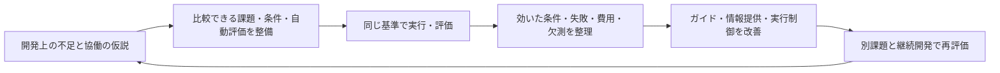

# プロジェクト計画: 協働を評価し、開発ハーネスへ戻す

更新: 2026-09-06。ユーザーによる目的の再確認を反映。
この文書が現在の目的・優先順位・到達条件の正本。
[Cycle 005までの計画](project-plan-history-through-cycle-005.md)は履歴として保持する。

## 目指すもの

**AIが相談、レビュー、多方面からの案の収集、複数実装の比較などを使って開発を進め、
単体では予算内に届かなかった成果に届く。その使い方を自動評価で改善し続ける開発ハーネス。**

マルチエージェントを利用できることを前提に、課題に応じて協働を組み立てる。
AIへ「どんな使い方があるか」「どんな条件で役立ったか」「何が悪化・未測定だったか」を渡す。
品質、利用可能になるまでの時間、全参加者の消費を評価し、効果のない協働を繰り返さない。
単体で十分な箇所を見つけることも、協働する箇所を見つけることも成果になる。

現在整えている実験群の役割は、**様々な観点から比較可能にし、評価結果をハーネスの改善へ戻すこと**。
個別の修正が完成したことと、その進め方の有効性が確認できたことは、それぞれ記録する。

ここでいうハーネスは、AIに渡す指示・skill・協働手順・情報と、tool、workspace、job、
検証・修正・停止の制御を含む。実験runnerと評価器は、その改善を測るための基盤。
評価器を直すときは版を分け、開発ハーネスの改善効果と混ぜない。

## 現在地

2026-09-06のrepository監査。過去の未実施扱いへの巻き戻しも、実装済みから効果実証済みへの飛躍もしない。

| 資産 | 確認できた到達点 | 今回の循環での役割・不足 |
| --- | --- | --- |
| [協働モデル](agents/collaboration-model.md)・[playbook](../project/docs/agents/collaboration-playbook.md) | 相談・比較・検証、独立性、引継ぎ、有限の対話、停止を説明済み。[独立reviewの検討](../temp/multi-agent-collaboration/04-cross-provider-synthesis.md)も存在 | 使い方の土台。方式別の適用条件と実測結果を結ぶ情報が不足 |
| native contract・agentctl・[自動観測](agents/collaboration-observation.md) | 有限job、所有権、結果contract、協働観測がある。G1/G3で運用上の不足も修正 | 実行・観測に再利用。job成功や発話回数から開発品質・因果効果は推定できない |
| [duration atlas](agents/duration-atlas/README.md)・[現集計](agents/duration-atlas/studies/current.md) | 36 case、113 series、139観測。現在の139件は全てprimary-only、参加者1・worker 0 | 課題群・評価器・観測・検索を再利用。協働方式の比較データではない。旧revisionや推論適格性の制限あり |
| [協働control-plane](../scripts/agent_duration_collaboration.py) | 複数の有限DAGをvalidate/run-fakeで検証できる | このcontrol-planeのlive provider実行とagentctl adapterは未実装。通常のagentctl実行能力と区別する |
| Evidence Forge [G1](agents/evidence-forge-g1-live-pilot-2026-09-05.md) / [G2](agents/evidence-forge-g2-live-pilot-2026-09-05.md) / [G3](agents/evidence-forge-g3-live-pilot-2026-09-05.md) | 実協働、独立検査、checkpoint、観測連結を試した。G2にsolo比較もある | 協働運用と仮説の探索材料。[評価器の独立性・予算差・天井の監査](project-review-2026-09-05.md)により、一般的効果の根拠には制限 |
| 開発Cycle 001〜005 | 題材選定、実モデル比較、自動評価、統合を実施済み。小規模・複数段階の双方を含む | 環境・検証・復旧改善の知見。協働方式の横断比較を済ませたことにはならない |
| [terminal](../experiments/development-harness/terminal/README.md)・[feedback](../experiments/development-harness/feedback/README.md) | 停止・保全・固定評価、新clock、公開checkと有限修正、疑似provider/実Docker検証。005でlive使用 | 共通基盤に再利用。複数参加者の実行・全費用・成果連結は追加確認が必要 |
| [duration検索skill](../project/.codex/skills/lookup-agent-duration/SKILL.md) | 条件に合う観測と欠測を返せる | 観測検索を保持し、その上に方式の使用条件と証拠を伝える層が必要。atlas自体に根拠のない推奨を足さない |

現atlasの根拠は`generated/duration-atlas/current.json`の`series_stratum.configuration`と
各seriesの`counts.runs`。139件は試験件数でも協働episode数でもない。
現時点では、**方式の情報提供から実行、評価、ハーネス改良、別課題での効果確認までを
一続きに検証した状態には到達していない**。

## 実施済みの題材・比較と現在地

| Cycle | 題材・結果 | 今後の扱い |
| --- | --- | --- |
| [001](agents/development-harness-cycle-001.md) | JSON非有限数拒否。両側33/33、379秒→235秒の1組 | 環境改善の探索結果と統合成果を保持 |
| [002](agents/development-harness-cycle-002.md) | template導入・更新・復旧の3段階ほか。高速化は未確認 | 継続変更、permission、統合品質の評価例として再利用 |
| [003](agents/development-harness-cycle-003.md) | ログ伏せ字と独立acceptance・証拠保存・復旧 | 予算超過・評価器の限界・統合修正を含めて保持 |
| [004](../experiments/development-harness/cycle-004/README.md) | 重複キー拒否。中断後の保全・評価・統合 | 計測経路を修理する根拠。最終速度比は未成立 |
| [005](../experiments/development-harness/cycle-005/result.md) | CLI同期の失敗保全。13/13同士、587.194秒対780.894秒。追加feedback修正なし | 互換性を根拠に実装を採用。自動feedbackの一般効果や多agentの効果を主張しない |

## 比較して答える問い

方式名に加え、課題の性質、得たい成果、情報境界、比較相手、品質判定、総予算、
結果に応じた変更先を先に決める。具体設計は[協働実験計画](agents/collaboration-experiment-plan.md)。

| 問い | 主な比較 | 改善先 |
| --- | --- | --- |
| 別agentへの相談で判断と実装が良くなるか | 同じmakerの追加調査 vs 別agentから証拠付き助言 | 相談の起動条件、渡すcontext、反証の要求 |
| 独立reviewで未検出の欠陥を減らせるか | 自己review継続 vs 固定成果への独立review＋修正 | reviewの時点、独立性、再現手順、採否と修正の引継ぎ |
| 多方面から案を集める価値があるか | 単体による複数案 vs 独立した観点の案＋統合 | 観点の分け方、重複除去、選択基準、相談の停止 |
| 複数実装から良いものを選べるか | 単体の逐次試作 vs 独立実装＋選択＋検証 | 候補作成・比較・選択・統合の手順 |
| 分業ややり取りが複合課題を前進させるか | 単体の継続開発 vs 分担・証拠交換・統合 | 境界の決め方、再開、矛盾の解消、統合責任 |
| これらの知識をAIに渡すと開発が改善するか | 同じ協働能力で、改良前の指示 vs 証拠を結んだ指示 | 配布するplaybook/skill、状況に応じた使い分け |

助言や案を使った後の診断、実装、制約充足、退行、継続変更を機械検証する。
相談の文章の上手さや案の数を最終品質にしない。自動判定できない創造性・好みは未測定とする。

## 到達条件と実行順

| 段階 | 成果物・完了条件 | 現状 |
| --- | --- | --- |
| M0: 目的と証拠の整理 | 循環、資産の実装/実測/未実証、各実験から変える対象を一つの計画へ統合 | 今回完了。今後の判断はこの目的へ戻す |
| M1: 実験群の適格性 | 既存候補を監査し、方式に適する課題と自動評価の範囲を決定。正解の多様性・欠陥検出・solo対照・費用計測を確認し、初回protocolを固定 | **進行中**。[証拠統合v2](../experiments/development-harness/consultation/synthesis_v2/README.md)を39候補で校正。[F04-L動作監査](../experiments/development-harness/selection/f04-lifecycle-audit.md)では2つの妥当な実装を受理し、旧評価の2種類の見逃しを再現。次は別版のreview→修正比較を校正する。旧pilotは実施済み、次のlive条件は未固定 |
| M2: 協働比較の自動実行 | 最初に適格となった方式を既存terminal/所有権/評価へ接続。受渡し、全参加者停止・全usage・統合・外部評価を疑似providerと実Dockerで確認 | [実Codex接続](../experiments/development-harness/consultation/synthesis-runtime.md)も実装。sandbox probe・環境同等性・全停止・採点を実比較で確認。途中相談やsession継続は未対応 |
| M3: 方式別の探索比較 | 相談・review・案収集・実装比較を対象に、適格な課題で有限の比較。正/負/不明、発動状況、失敗、全費用、未着手を保存 | [事前相談の新経路pilot](../experiments/development-harness/consultation/synthesis-result.md)を一組実施。品質解釈は評価器の誤判定により保留。他方式を済ませたことにしない |
| M4: ハーネス改良と再評価 | 採用/条件限定/棄却/保留を決め、指示・情報・実行制御を版付きで改修。結果を見ていない課題で改良前後を再評価 | 集計guard・実測ガイドへ採否を反映。別評価版のprovider-free校正まで完了。改良した協働手順の未使用課題での実比較は未実施。**ここまでを最初の改善循環の完了条件**とする |
| M5: 継続開発で確認 | AIが方式を選び直し、仕様追加・状態引継ぎ・復旧・統合まで進める。強いsoloと改良前ハーネスを対照に確認 | 複数段階の既存資産を使う。単発fixtureからproject全体へ一般化しない |

M3→M4は方式ごとに繰り返す。全方式の探索が終わるまで最初の改善を待たない。
他方式の未実施は明示して残し、共通の改善はそれぞれの比較で確認する。

M1ではまずF03-L（再起動障害の診断）、F02-M（隔離review）、F12-L revision 3（制約下の案と統合）、
F04-L（再起動を含む実装）を方式との適合性から調べる。これは**候補集合というplanning prior**。
根拠は公開contract・自動oracle・方式との対応で、モデルの勝敗ではない。
一次監査でF03-Lは公開文が原因のevent順序を明示すると確認した。
[別版](../experiments/development-harness/consultation/v1/README.md)を実装し、評価側の実状態による採点と
実Dockerを含む11テストを確認した。ただし公開toolだけの有限探索で両variantが解けるため、
主比較には不採用とし、実行経路の校正・不要な相談を測る対照候補として保持する。
M2ではこの小課題を使って疑似providerの受渡し・全停止・外部採点を接続した。
M1のF12-L revision 3も[反例監査](../experiments/development-harness/selection/f12-synthesis-audit.md)を実施。
機能しない対策・rollbackでも12/12になるため、現版は数値・参照・明示制約の組立てに測定範囲を限定する。
限定した問い・全予算・採否基準を固定し、live比較まで進めた。元の得点は両方10/12で、
相談側は336.729秒、soloは282.256秒。否定表現と複数の関連unknownを不当に拒む条件を再現したため、
品質改善の判断を保留し、旧得点を維持したまま品質付き速度比を自動的に抑止する。
[別評価版v2](../experiments/development-harness/consultation/synthesis_v2/README.md)では公開されたscope・根拠関係・topic網羅を検査し、
正当な10候補を受理し、不正な27候補を拒否した。自由文の虚偽と無効な運用手順を検出できない2候補も明示し、
構造化assembly以外の品質比較には未採用。実Dockerを含む14テストを確認し、旧原結果・sealのhash不変を確認した。
F04-Lの[9実装監査](../experiments/development-harness/selection/f04-lifecycle-audit.md)では、
直接上書きと空白引数を壊すwrapperが旧4/4を通った。別processの動作probeでこの2欠陥を検出し、
異なる原子的writerも受理した。実Dockerを含む7テストを確認。過去10観測中9満点は旧検査の結果であり、
成果物未保存のため再採点しない。書込み中のprocess kill・電源断・競合は未測定とする。
次は同じ初期実装をsoloで点検・修正する条件と、独立review→fresh修正担当の条件を比較する別版を作る。
修正後の実動作と退行を採点し、正しい初期実装も対照に含める。課題・外部評価・全予算を固定してからliveへ進む。
これはM1のplanning priorであり、相談や複数実装の有効性を仮定しない。同じ旧oracleで本数を増やさない。
他候補も現contractで答えられる問いに限定し、過去の資産を勝敗の期待から捨てない。
追加人数・repeat・期限は全体のdefaultにせず、M1で参加者の役割と全体予算から固定する。
ownerはprimary/integrator。識別力不足、実利用との不一致、準備費過大でpriorを更新する。

## 比較と採否の原則

- **能力の拡張:** 同じ公開要求と事前固定した予算方針の下で、soloが未達だった要求への到達を測る。
  「単体には絶対不可能」とは主張しない。別課題・反復の根拠なしに一般推奨しない。
- **品質・速度・費用:** 全開始runを含む到達率、要求別品質、品質付き提出時間、利用可能までの実時間、
  全参加者と選択・統合・修正・評価の費用を分ける。時間制約と総消費制約の比較は別に明示する。
- **強い対照:** soloにも自己検証、複数案、試作、同じ公開toolを許す。追加agent分の資源と、
  別context/独立性の効果を切り分ける。同じoutput上限だけを同費用と呼ばない。
- **実際の発動:** 設定、dispatch、受渡し、採否、最終artifactの関係を区別する。
  方式が発動しなくても割付結果から除外しない。発動例だけを集めた因果主張はしない。
- **評価の独立性:** 開発側はhidden oracleへアクセスしない。固定採点を人やLLMで上書きしない。
  学習用課題、確認用課題、運用観測を分ける。校正用の模範解答は方式の効果の証拠ではない。
- **採否:** 品質の重大退行を速度で相殺しない。改善量・許容費用・精度目標は比較前に課題ごとに定める。
  差なし、費用増、欠測からも起動条件・上限・案内を改善する。好結果まで追加実行しない。

clock、停止・保全、規模、欠測の詳細は[評価方針](agents/development-harness-evaluation.md)を維持する。
数値にはhard guard / cost cap / planning prior / hypothesisの区別、範囲、根拠、見直し条件、ownerを付ける。
機械で保証できないusage上限を保証済みにしない。単価が不明ならtokenを金額へ換算しない。

## 進行が逸れないための判断

次の作業は「どの比較の不足を埋め、どのハーネス判断を可能にするか」を説明できるものにする。
環境故障は比較を止めるなら修理し、通常保守は別の成果として扱う。
小さなbug fixを繰り返しただけで協働の比較範囲が広がったとは数えない。

外部projectのパスやユーザーによる題材提出は開始条件にしない。既存の題材を再利用し、
新しい実要求が必要な場合だけ不足を具体化する。サンプルアプリの本repositoryへの追加、
常駐scheduler、provider/model/人数の総当たりは、この循環を成立させる前提にしない。

進捗は「今回答えられた問い」「証拠」「ハーネスの変更」「次に検証する不確実性」を中心に報告する。
ユーザーに採点・log維持・形式的な再承認を求めない。過去のprotocol・artifact・得点は保持する。
