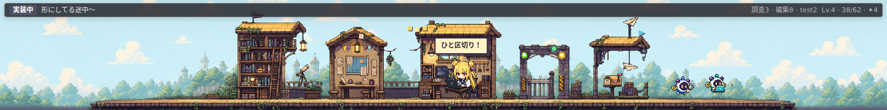
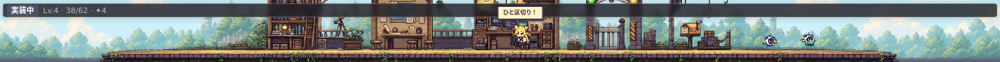

# Mira World v2 visual QA

検証日: 2026-08-12

productionの`world.css`とruntime assetsをheadless Chromeで描画し、VS Code bottom panel相当の2つの高さで確認した。

## 1440 x 180

- 5拠点とwalking laneが同時に見える。
- Miraはmapの縮尺に対して十分識別でき、coding workshopへ接地する。
- contextual popはMiraの真上に出るが、HUDとは衝突しない。
- 2体のsubagent companionはdispatch dock側で本体と重ならない。
- session summaryとprogressは一行で収まる。

## 1440 x 90

- responsive ruleにより台詞とsession detailが消え、状態とprogressだけが残る。
- backgroundはbottom基準でcropされ、walking laneと接地線を失わない。
- Mira、earned pop、companionは小さくなるが判別可能。
- coding editorを主役にしたshort-strip fallbackとして成立する。

## 判定

v2 layoutを採用する。panel heightはextension APIから固定せず、VS Codeとユーザーのresizeを尊重する。

`layout-preview.html`はproduction extensionへpackageされないlocal visual harnessで、sample appではない。
